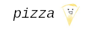

<div align="center">
<br>
</div>

The pizza project aims to implement an interpreter for an assembler language.
The spec will be uploaded in a few days, but for now here is an outline of the
project.

## Why

Because it sounds like fun, and is unique.

## Wiki

The official wiki can be found [here](https://wiki.skiqqy.xyz/en/pizza), it contains the specification of pizza and slice-lang.

## Testing

pizza is under active development, to run the __all__ tests for the current build
simply run,
````
$ make test
````
If you wish to test by unit instead, see below.

### Testing lexer
````
$ make testlexer
````
