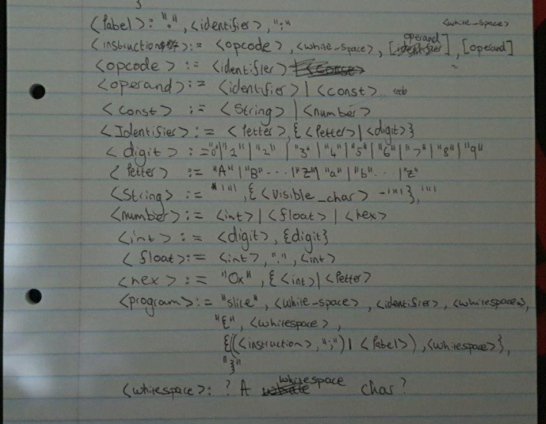

 

The pizza project aims to implement an interpreter for an assembler language.
The spec will be uploaded in a few days, but for now here is an outline of the
project.

## Why

Because it sounds like fun, and is unique.

## Pre Spec/ General plan

* RISC isa.
* Written in C.
* Custom Assembler lang, called slice.

## Registers

| Register | Details |
| -- | -- |
| R0 | Normally stores the result from an instruction |
| R1 | General Use |
| R2 | General Use |
| R3 | General Use |
| R4 | Contains extra output from other instructions |
| R5 | TODO |
| R6 | Same as esp |
| R7 | Same as ebp |

## Flags

The flags will contain the results from (mostly) logic operations.
See the table below to see what the bits represent.
Note you cannot access the Flags register directly, instead you operate on it
indirectly via the instructions being parsed.

| Bit # | Bit Mask |    Name     | Abbreviation |   =1    | =0       |
| ----- | -------- | ----------  | ------------ | ------- | -------- |
| 0     | 0x0001   | Zero Flag   | ZF           | Is Zero | Not Zero |
| 1     | 0x0002   | Sign Flag   | SF           | Is Neg  | Is Pos   |
| 2     | 0x0004   | Parity Flag | PF           | Is Even | Is Odd   |

[comment]: # (|       | 0x0000   |           |              |         |          |)

## Instruction Set

This includes the syntax, and a rough explenation after the ';'.

### Logic
* `cmp <reg1> <reg2>;` Sets the flags register bits to be used by other funcs.
* `jg <label>;` Checks flags, if true jumps to the label.
* `jl <label>;` Checks flags, if true jumps to the label.
* `jeq <label>;` Checks flags, if true jumps to the label.

### Unary Operators
* `push <reg/const>;` Pushes the contents of reg/ the constant onto the stack.
* `pop <reg;>` Remove the value from the top of the stack and store it in `<reg>`.

### Binary Operators
* `store <reg1> <reg2/Const>;` Basically `<reg1> = <reg2/Const>`.
* `add <reg1> <reg2/Const>;`   Basically `<reg1> += <reg2/const>`.
* `imul <reg1> <reg2/Const>;`  Basically `R0 = <reg1>*<reg2/const>`, for signed integer multiplication.
* `idiv <reg1> <reg2/Const>;`  Basically `R0 = <reg1>/<reg2/const>`, `R4` contains the remainder.
* `fmul <reg1> <reg2/Const>;`  Basically `R0 = <reg1>*<reg2/const>`.

### "System" Calls
* `flush <reg> <File descriptor (int)>;` `reg` must point to a null string.
* `malloc <const int n>` Basically `R0 = malloc(sizeof(char)*n)`.

## EBNF
Please note, this is a rough draft of the ebnf, and most likely contains a few errors,

## TODO

- [ ] Design ebnf for `slice` lang.
- [ ] Create a formal spec.
- [ ] Decide on instruction's.
